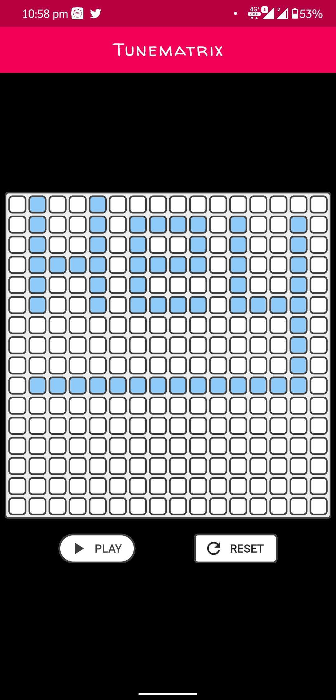

# Tunematrix

A music grid instrument inspired by Tone matrix, a pentatonic step sequenzer which produces relaxing sonal patterns.
### This is a beautiful looking app with smooth and beautiful animations.

# Screenshots

  

# Links

- [Tonematrix:](https://tonematrix.audiotool.com/) Amazing flash app that allows you create beautiful melodies.
